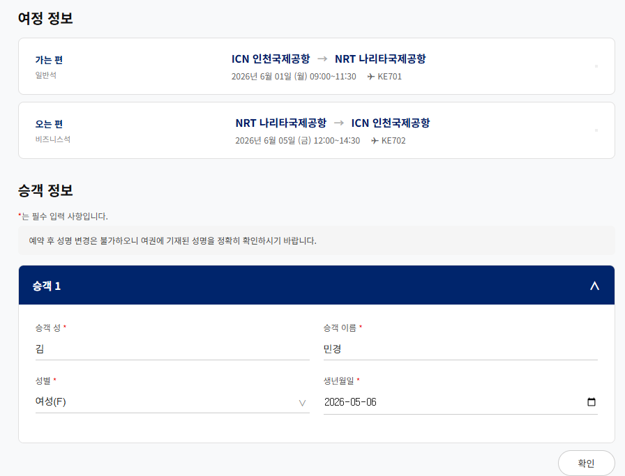
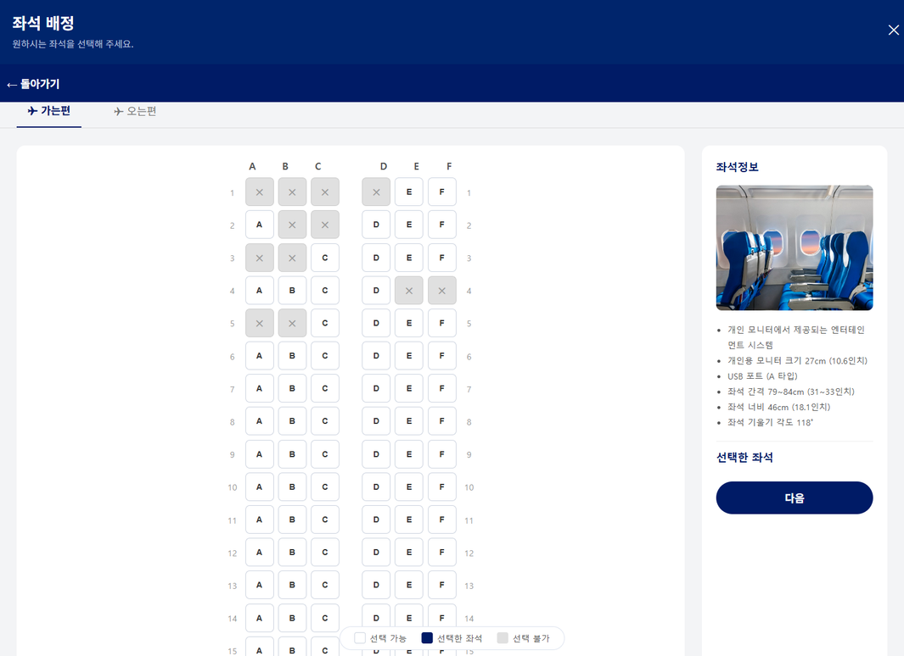
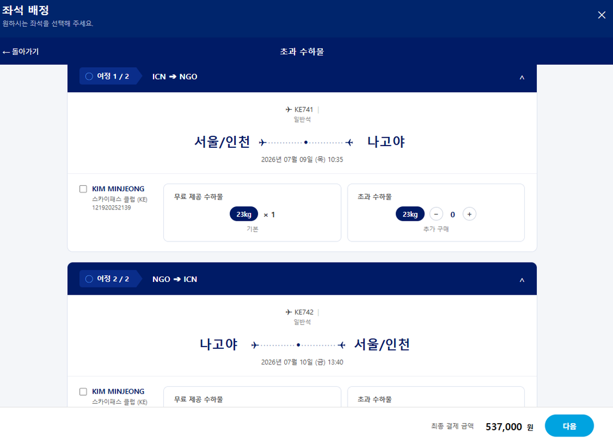
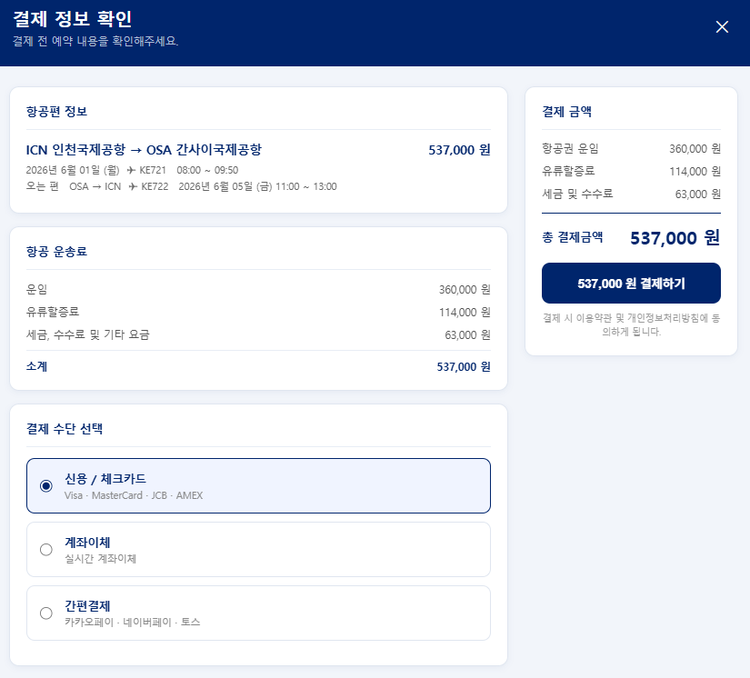
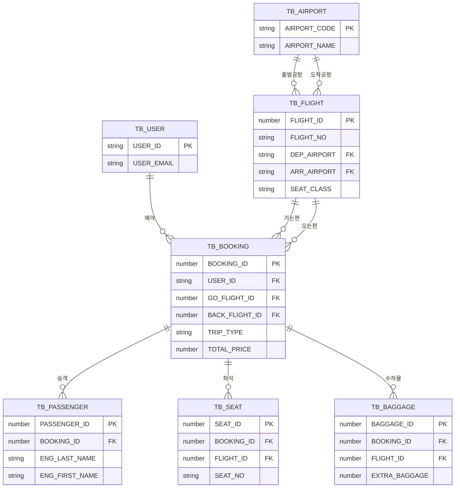

# ✈️ AcornAir — 항공권 예약 웹 서비스

> Acorn Academy 팀 프로젝트(2026.04.28 ~ 05.14)를 기반으로 한 개인 포트폴리오 저장소입니다.
> 팀 제출 원본 저장소: [AcornAIr](https://github.com/minjeong333/AcornAIr.git)

---

## 프로젝트 개요

대한항공 웹사이트를 레퍼런스로, 항공편 검색 → 좌석 선택 → 결제 → 예약 조회로 이어지는
항공 예약 시스템을 Java/JSP/Servlet + Oracle DB로 구현한 5인 팀 프로젝트입니다.

- **기간**: 2026.04.28 ~ 2026.05.14 (개발 9일 + 발표)
- **인원**: 5인 팀 프로젝트
- **아키텍처**: MVC 패턴 (Controller - Service - DAO)

## 담당 기능 (김민정)

예약 후반부 흐름인 **승객정보 입력 → 좌석 배정 → 추가 수하물 → 결제** 구간을 구현했습니다.
README에는 구현 범위와 관련 파일을 중심으로 정리하고, 협업/회고 내용은 별도 문서로 분리했습니다.

| 기능 | 구현 내용 | 관련 파일 |
|---|---|---|
| 승객정보 입력 | 승객 수에 따른 다중 입력 폼 생성, 연락처 정보 세션 저장 | `PassengerServlet`, `passenger_info.jsp/js/css` |
| 좌석 배정 | 가는편/오는편 좌석 선택, 예약 좌석 비활성화, 승객 수와 선택 좌석 수 검증 | `SeatServlet`, `seatSelect.jsp/css` |
| 추가 수하물 | 수하물 개수별 추가 요금 계산, 예약 정보 반영 | `BaggageServlet`, `baggage.jsp` |
| 결제 | 예약/승객/좌석/수하물 데이터 트랜잭션 일괄 저장 | `PaymentServlet`, `PaymentService`, `payment.jsp` |
| 예약 내역 조회 일부 | 1:N JOIN 중복으로 인한 승객명/좌석번호 누락 문제 수정 | `ReservationDAO` |

**협업 기록**

- Git feature/fix 브랜치와 PR 기반 병합 흐름 사용
- 기획명세서 작성 참여
- 개인 포트폴리오 저장소 기준 커밋 이력 정리

## 기술 스택

- **Backend**: Java, Servlet, JSP (MVC 패턴)
- **Database**: Oracle (TB_USER, TB_FLIGHT, TB_AIRPORT, TB_BOOKING, TB_PASSENGER, TB_SEAT, TB_BAGGAGE, CHATBOT_DATA — 8개 테이블)
- **Frontend**: HTML, CSS, JavaScript (모달/iframe 단계 전환 + `postMessage` 통신)
- **협업**: Git (feature/fix 브랜치 전략, PR 리뷰/머지)

## 핵심 기능

- **다중 승객 처리**: 승객 수(`passCnt`)에 따라 입력 폼을 동적으로 생성
- **세션 기반 예약 흐름**: 승객정보~수하물까지 세션에 누적 후, 결제 시점에 트랜잭션으로 일괄 처리
- **왕복 항공권**: `GO_FLIGHT_ID`/`BACK_FLIGHT_ID`로 가는편·오는편을 분리 관리

### 1) 승객정보 입력
세션에 저장된 승객 수(`passCnt`)만큼 동적으로 입력 폼을 생성하여 다중 승객을 처리합니다.

### 2) 좌석 배정
이미 예약된 좌석을 DB에서 조회해 비활성화 처리하고, 좌석 등급(일반석/비즈니스석)별로
다른 좌석 배치를 렌더링하며 가는편/오는편 등급을 분리 적용해 가격을 계산합니다.

### 3) 추가 수하물
수하물 개수에 따른 추가 요금을 계산해 예약 정보에 반영합니다.

### 4) 결제
결제 시점에 트랜잭션으로 예약·승객·좌석·수하물 정보를 일괄 INSERT합니다.

## ERD

## 더 알아보기

- 🔧 [트러블슈팅 — JOIN으로 인한 행 증가와 LISTAGG 중복 문제](docs/TROUBLESHOOTING.md)
- 🚀 [발표 이후 개인 개선 작업](docs/IMPROVEMENTS.md)
- 💭 [회고](docs/RETROSPECTIVE.md)
